  

  

  

  
  
  
  

  <a href="#about-arena">About</a> ·
  <a href="#whats-inside-arena">Inside</a> ·
  <a href="#live-github-pulse">Stats</a> ·
  <a href="#the-arena-stack">Stack</a> ·
  <a href="#arena-spotlight">Spotlight</a> ·
  <a href="#about-the-maker">Maker</a>

---

## 🏟️ About Arena

**Arena** is my public playground — one repo where ideas get thrown in, experimented on, and occasionally made to shine. No hidden drafts, no gatekeeping: everything lives out in the open, tracked, versioned, and visibly **alive**.

> 🏟️ *One repo. Infinite possibilities.*

Everything above this line is **live** — the view counter, the stars, the followers, even the last-commit badge update on their own. Scroll down to see the arena's scoreboard.

## 👀 The views counter

The badge at the top tracks **every time this README is seen**. Each visit bumps the number, so it doubles as a tiny real-time popularity meter — no analytics, no tracking, just a counter that never lies (well, it only counts the truth).

## 🎪 What's inside Arena

| Piece | Why it matters |
|---|---|
| ⚡ **Live everything** | view counter, stars, followers & last-commit badges refresh in real time |
| 📈 **Stats on tap** | GitHub stats, top languages & streak cards render automatically |
| 🎬 **Motion** | animated banner + typing headline — READMEs don't have to be static |
| 🧩 **Collapsible blocks** | click-to-expand sections keep the story tidy |
| 🔓 **Open by default** | all of it is public and remixable |

## 📊 Live GitHub pulse

<!-- Auto-refreshing cards — no maintenance needed. -->

  
  

  

## 🧰 The Arena stack

  
  
  
  
  
  
  

## 📸 Arena spotlight

| Project | What it is |
|---|---|
| [Project-1-Exploratory-Data-Analysis](https://github.com/Ped20/Project-1-Exploratory-Data-Analysis) | 🧪 First dive — exploring datasets end to end |
| [Project-2-ANOVA-Post-Hoc-test](https://github.com/Ped20/Project-2-ANOVA-Post-Hoc-test) | 📊 Comparing groups, properly |
| [Project-3-linear-regression](https://github.com/Ped20/Project-3-linear-regression) | 📈 Predicting outcomes with linear models |
| [Project-4-Clustering-and-PCA](https://github.com/Ped20/Project-4-Clustering-and-PCA) | 🧬 Finding structure in the noise |
| [Project-5-shiny-dashboard](https://github.com/Ped20/Project-5-shiny-dashboard) | 🎛️ Turning analysis into interactive dashboards |

## 🧑‍🚀 About the Maker

> Hi! I'm **Prathamesh Deshmukh** ([@Ped20](https://github.com/Ped20)) — builder of **Arena**, data-science explorer from **Pune, India**.

- 🔬 Exploring **EDA, ANOVA, regression, clustering & PCA** — one R project at a time
- 🎛️ Turning stats into **interactive Shiny dashboards**
- 🏟️ Founder & chief janitor of this Arena
- 💬 Always up for talking data, R, or why p-values deserve more respect

<b>🧑‍🚀 A bit more about me</b>

 

- 🌱 Currently learning: advanced statistics & dashboard design
- 🎯 Current goal: ship something interesting every week
- ☕ Fuel: chai (obviously)
- 🐛 Bug philosophy: every error is a feature request from the future

<b>🗺️ Roadmap — what's next for Arena</b>

 

- [x] Launch the Arena repo
- [x] Live view counter + real-time badges
- [ ] Spotlight gallery for every project
- [ ] Public stats API for the arena
- [ ] Community corner — your ideas here

<b>🎲 Arena fun facts</b>

 

- The counter started at **1** the moment this README went live.
- Every time someone opens this page, the view count goes up — so yes, *you just did*. 👀
- The banner is a hand-written **animated SVG** — no GIFs were harmed.

---

  <b>Thanks for visiting the Arena 🙌</b>

  Made with ❤️ and way too much R. — @Ped20

